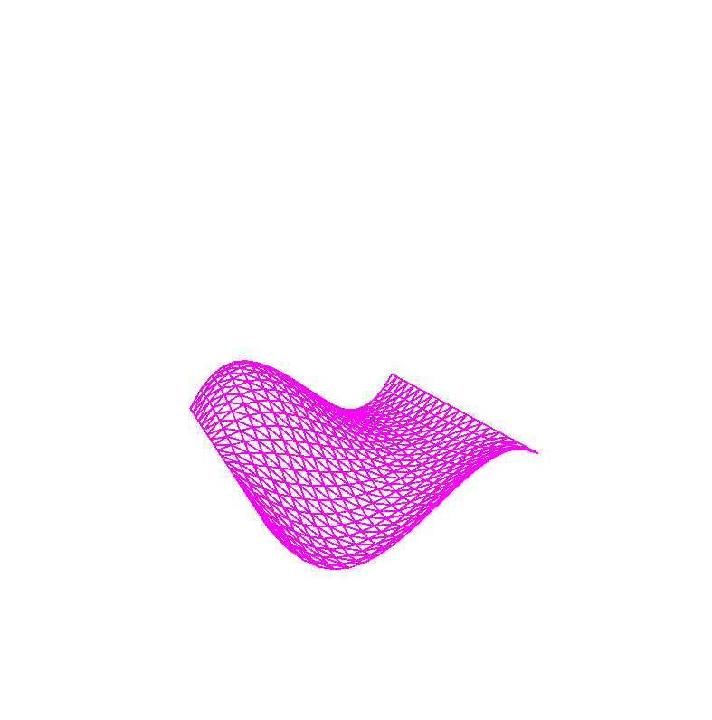

# curve-editor
 A program that takes a drawn curve & generates geometry from it by taking the surface of revolution.

This project uses OpenGL, rendering curves build from control points using either Bezier of B-Spline subdivision. 

A drawn curve may then be viewed as if it was a piece of pottery: rotated 360 degrees about the center of the window to create a shape. 

There also a couple of built in surfaces which are generated randomly at runtime, which you can choose to render with either subdivision algorithm. 

# Running the project

This program was written as part of an assignment, using the course's boilerplate. As such it is recommended that you open the root folder of this repository in Visual Studio 2019, and built it with the MSVC C++ compiler. 

# Controls

## In the curve editor:

- The curve editor has the Y-axis at it's center, so asymmetric curves should not intersect the vertical middle. (produces some cool shapes if you do this, tho)
- Press (and hold) TAB to select a point near the mouse to edit  (will not select if not close), and move your mouse to change it's position. 
- Left click to add a point at the location of the cursor.
- Right click to delete the point nearest to the cursor. 
- Press (and hold) W to zoom in.
- Press (and hold) S to zoom out.
- Press C to clear the curve, starting new with only a new point at the origin (move this using TAB + mouse as desired).
- Press B to switch between Bezier and B-Spline curves (default is Bezier).

## In the 3D viewer: (will lock your mouse until you switch back to the curve editor)

Camera controls:
- Move the mouse to change where the camera is facing.
- Press (and hold) W to move the camera forward.
- Press (and hold) S to move the camera backwards.
- Press (and hold) A to move the camera left.
- Press (and hold) D to move the camera right.

Scene controls:
- Press J to toggle between wireframe and fill. (default is fill)
- Press 1 (one) to view the object generated by the Surface of Revolution of the curve in the curve editor. (default 3D scene) 
- Press 2 to view the first tensor product surface generated by my code 
- Press 3 to view the second tensor product surface generated by my code
- Note that the tensor product surfaces have some randomness, so these curves will be different from execution to execution.
- While viewing a surface (after pressing 2 or 3):
    - Press P to toggle whether or not the control points for the surface are drawn. (default is off)
    - Press B to toggle whether Bezier or B-Spline subdivision is used (same as whichever is used in curve editor).